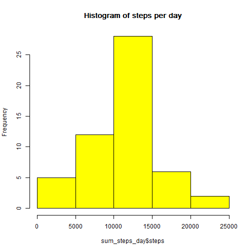
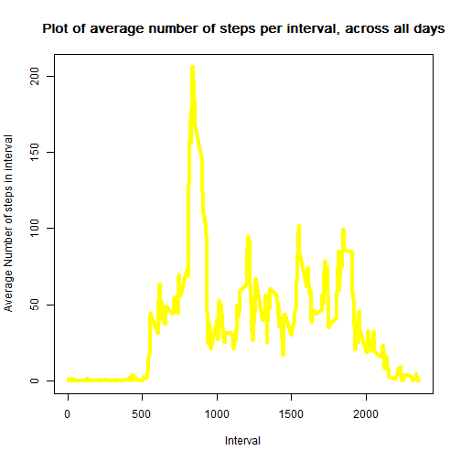
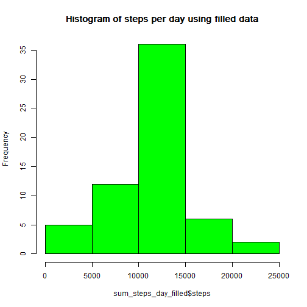
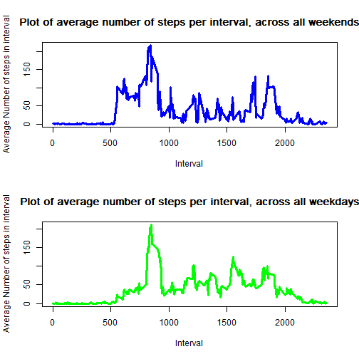

## Getting the necessary packages

```r
#install.packages('dplyr')
library(dplyr)
```

## Loading and preprocessing the data
Let's assume the data is present in the same directory as the Rmd (as it is in the original git repository: [RDPeng Repository][1]).  
The Unzipping can be done directly in R:

```r
data <- read.csv(unzip("activity.zip")) # not very elegant, it will always unzip, but ok for this size
```
Let's take a glimpse of the data, just to make sure everything is ok:  

```r
summary(data)
```

```
##      steps                date          interval     
##  Min.   :  0.00   2012-10-01:  288   Min.   :   0.0  
##  1st Qu.:  0.00   2012-10-02:  288   1st Qu.: 588.8  
##  Median :  0.00   2012-10-03:  288   Median :1177.5  
##  Mean   : 37.38   2012-10-04:  288   Mean   :1177.5  
##  3rd Qu.: 12.00   2012-10-05:  288   3rd Qu.:1766.2  
##  Max.   :806.00   2012-10-06:  288   Max.   :2355.0  
##  NA's   :2304     (Other)   :15840
```

```r
str(data)
```

```
## 'data.frame':	17568 obs. of  3 variables:
##  $ steps   : int  NA NA NA NA NA NA NA NA NA NA ...
##  $ date    : Factor w/ 61 levels "2012-10-01","2012-10-02",..: 1 1 1 1 1 1 1 1 1 1 ...
##  $ interval: int  0 5 10 15 20 25 30 35 40 45 ...
```

```r
#pairs(data) Not really usefull in this case
```
  
  
  
  
## What is mean total number of steps taken per day?
Ok, for this part we can ignore NAs and we will need to aggregate the data per day (using dplyr).  


```r
data_per_day <- group_by(data,date)
data_per_day
```

```
## Source: local data frame [17,568 x 3]
## Groups: date
## 
##    steps       date interval
## 1     NA 2012-10-01        0
## 2     NA 2012-10-01        5
## 3     NA 2012-10-01       10
## 4     NA 2012-10-01       15
## 5     NA 2012-10-01       20
## 6     NA 2012-10-01       25
## 7     NA 2012-10-01       30
## 8     NA 2012-10-01       35
## 9     NA 2012-10-01       40
## 10    NA 2012-10-01       45
## ..   ...        ...      ...
```

```r
sum_steps_day <- summarise(data_per_day, steps = sum(steps))
sum_steps_day <-na.omit(sum_steps_day)
```
And arrive at the first calculation asked:  
**1.Calculate the total number of steps taken per day**


```r
sum_steps_day
```

```
## Source: local data frame [53 x 2]
## 
##          date steps
## 1  2012-10-02   126
## 2  2012-10-03 11352
## 3  2012-10-04 12116
## 4  2012-10-05 13294
## 5  2012-10-06 15420
## 6  2012-10-07 11015
## 7  2012-10-09 12811
## 8  2012-10-10  9900
## 9  2012-10-11 10304
## 10 2012-10-12 17382
## ..        ...   ...
```
**2.Make a histogram of the total number of steps taken each day**

```r
hist(sum_steps_day$steps, main = "Histogram of steps per day", col="yellow")
```

 

**3.Calculate and report the mean and median of the total number of steps taken per day**
We already have the sum of steps per day, the mean and median are rather direct. Notice that sum_steps_day is already stripped of NA values, so na.rm = TRUE is unnecessary:

```r
mean_steps_day<-mean(sum_steps_day$steps, na.rm = TRUE)
mean_steps_day
```

```
## [1] 10766.19
```

```r
mean_steps_day<-mean(sum_steps_day$steps)
mean_steps_day
```

```
## [1] 10766.19
```

```r
median_steps_day<-median(sum_steps_day$steps)
median_steps_day
```

```
## [1] 10765
```
## What is the average daily activity pattern?
**Make a time series plot (i.e. type = "l") of the 5-minute interval (x-axis) and the average number of steps taken, averaged across all days (y-axis)**
Ok, we need to aggregate per interval instead of per day:

```r
data_per_interval <- group_by(data,interval)
##data_per_interval

mean_steps_interval <- summarise(data_per_interval, steps = mean(steps,na.rm = TRUE))
##mean_steps_interval
```
Now the plotting itself should be easy:  
 * type="l" sets the plot to line instead of points  
 * main="Plot of average number of steps per interval, across all days" gives the plot a title  
 * xlab="Interval" gives XX a label (I actually don't know what the interval mean, I presume it must be the absolute starting minute of the day)  
 * ylab="Average Number of steps in interval" gives YY a label  
 * col = "yellow" adds a nice common style between all charts :)  
 * lwd = 4 increases line width (maybe yellow is not such a great choice)  

```r
 plot(x = mean_steps_interval$interval,y  = mean_steps_interval$steps
    , type = "l"
    , main="Plot of average number of steps per interval, across all days" 
    , xlab="Interval" 
    , ylab="Average Number of steps in interval"
    , col = "yellow"
    , lwd = 4)
```

 

**Which 5-minute interval, on average across all the days in the dataset, contains the maximum number of steps?**  
Just by looking at the plot above, we get the notion that the interval with the maxium average must be somewhere between 500 and 1000, closer to 1000. We can filter the original vector using the maximum value as condition, as such: 

```r
max_interval <- filter(mean_steps_interval, steps==max(mean_steps_interval[,2]))
max_interval
```

```
## Source: local data frame [1 x 2]
## 
##   interval    steps
## 1      835 206.1698
```
The question asks for the interval only, so we should be precise:

```r
max_interval[[1,1]]
```

```
## [1] 835
```
## Imputing missing values

**Calculate and report the total number of missing values in the dataset (i.e. the total number of rows with NAs)**  

Curiously enough, the only column with NA is "steps", so we could count those.  
Instead, we'll use a function that specifically returns the rows with no NA - complete.cases.  
What we want to find is actualy the opposite, so we need to substrat from the total:  

```r
nrow(data)
```

```
## [1] 17568
```

```r
nrow(data[complete.cases(data),])
```

```
## [1] 15264
```

```r
nrow(data)-nrow(data[complete.cases(data),])
```

```
## [1] 2304
```

**Devise a strategy for filling in all of the missing values in the dataset. The strategy does not need to be sophisticated. For example, you could use the mean/median for that day, or the mean for that 5-minute interval, etc.**  
**Create a new dataset that is equal to the original dataset but with the missing data filled in.**  


We will use de mean for the interval, and fulfill this by iterating through the data and substituting any NA found in the Steps column:

```r
dataFilled <- data

i<-1
for (i in 1:nrow(dataFilled)){
        if (is.na(dataFilled[i,1])){
                
                dataFilled[i,1]<-as.numeric(filter(mean_steps_interval,
                                                interval==(dataFilled[i,3]))[1,"steps"])
                }
        
}
```

**Make a histogram of the total number of steps taken each day and Calculate and report the mean and median total number of steps taken per day. Do these values differ from the estimates from the first part of the assignment? What is the impact of imputing missing data on the estimates of the total daily number of steps?**  


```r
data_per_day_filled <- group_by(dataFilled,date)
sum_steps_day_filled <- summarise(data_per_day_filled, steps = sum(steps))
hist(sum_steps_day_filled$steps, main = "Histogram of steps per day using filled data", col="green")
```

 

```r
mean_steps_day<-mean(sum_steps_day_filled$steps)
paste("Mean: ",mean_steps_day)
```

```
## [1] "Mean:  10766.1886792453"
```

```r
median_steps_day<-median(sum_steps_day_filled$steps)
paste("Median :",median_steps_day)
```

```
## [1] "Median : 10766.1886792453"
```


## Are there differences in activity patterns between weekdays and weekends?

> **Create a new factor variable in the dataset with two levels - "weekday" and "weekend" indicating whether a given date is a weekday or weekend day.**  


```r
class(dataFilled$date)<-"Date"
dataFilled <- mutate(dataFilled, 
                    wday=weekdays(date,abbreviate=FALSE),
                    weekend=as.factor(ifelse(wday %in% c("sábado","domingo"),
                                                "weekend",
                                                "weekday"
                                            )
                                    )
                    )
str(dataFilled)
```

```
## 'data.frame':	17568 obs. of  5 variables:
##  $ steps   : num  1.717 0.3396 0.1321 0.1509 0.0755 ...
##  $ date    : Date, format: "1970-01-02" "1970-01-02" ...
##  $ interval: int  0 5 10 15 20 25 30 35 40 45 ...
##  $ wday    : chr  "sexta-feira" "sexta-feira" "sexta-feira" "sexta-feira" ...
##  $ weekend : Factor w/ 2 levels "weekday","weekend": 1 1 1 1 1 1 1 1 1 1 ...
```

```r
distinct(dataFilled,wday)
```

```
##       steps       date interval          wday weekend
## 1  1.716981 1970-01-02        0   sexta-feira weekday
## 2  0.000000 1970-01-03        0        sábado weekend
## 3  0.000000 1970-01-04        0       domingo weekend
## 4 47.000000 1970-01-05        0 segunda-feira weekday
## 5  0.000000 1970-01-06        0   terça-feira weekday
## 6  0.000000 1970-01-07        0  quarta-feira weekday
## 7  0.000000 1970-01-08        0  quinta-feira weekday
```

> **Make a panel plot containing a time series plot (i.e. type = "l") of the 5-minute interval (x-axis) and the average number of steps taken, averaged across all weekday days or weekend days (y-axis). See the README file in the GitHub repository to see an example of what this plot should look like using simulated data.**  


```r
dataFilled_weekend <- filter(dataFilled, weekend=="weekend")
dataFilled_weekend <- group_by(dataFilled_weekend, interval)
dataFilled_weekend_mean_step <- summarise(dataFilled_weekend, steps= mean(steps))
dataFilled_weekend_mean_step
```

```
## Source: local data frame [288 x 2]
## 
##    interval       steps
## 1         0 1.984276730
## 2         5 1.018867925
## 3        10 0.396226415
## 4        15 0.008385744
## 5        20 0.226415094
## 6        25 0.838574423
## 7        30 1.584905660
## 8        35 0.048218029
## 9        40 0.000000000
## 10       45 4.081761006
## ..      ...         ...
```

```r
dataFilled_weekday <- filter(dataFilled, weekend=="weekday")
dataFilled_weekday <- group_by(dataFilled_weekday, interval)
dataFilled_weekday_mean_step <- summarise(dataFilled_weekday, steps=mean(steps))
dataFilled_weekday_mean_step
```

```
## Source: local data frame [288 x 2]
## 
##    interval      steps
## 1         0 1.60508995
## 2         5 0.05528741
## 3        10 0.02150066
## 4        15 0.21061869
## 5        20 0.01228609
## 6        25 2.62000878
## 7        30 0.08600263
## 8        35 1.21105748
## 9        40 0.00000000
## 10       45 0.37911365
## ..      ...        ...
```

```r
par(mfrow = c(2, 1))
plot(dataFilled_weekend_mean_step$interval, dataFilled_weekend_mean_step$steps, 
     type="l",   
     ,main="Plot of average number of steps per interval, across all weekends"  
     ,ylab="Average Number of steps in interval"
     ,xlab="Interval"
     ,col="blue"
     ,lwd=3
     #,ylim=c(0,250)
     )

plot(dataFilled_weekday_mean_step$interval, dataFilled_weekday_mean_step$steps, 
     type="l",   
     ,main="Plot of average number of steps per interval, across all weekdays"  
     ,ylab="Average Number of steps in interval"
     ,xlab="Interval"
     ,col="green"
     ,lwd=3
     #,ylim=c(0,250)
     )
```

 


[1]: https://github.com/rdpeng/RepData_PeerAssessment1 "Original Repo"
